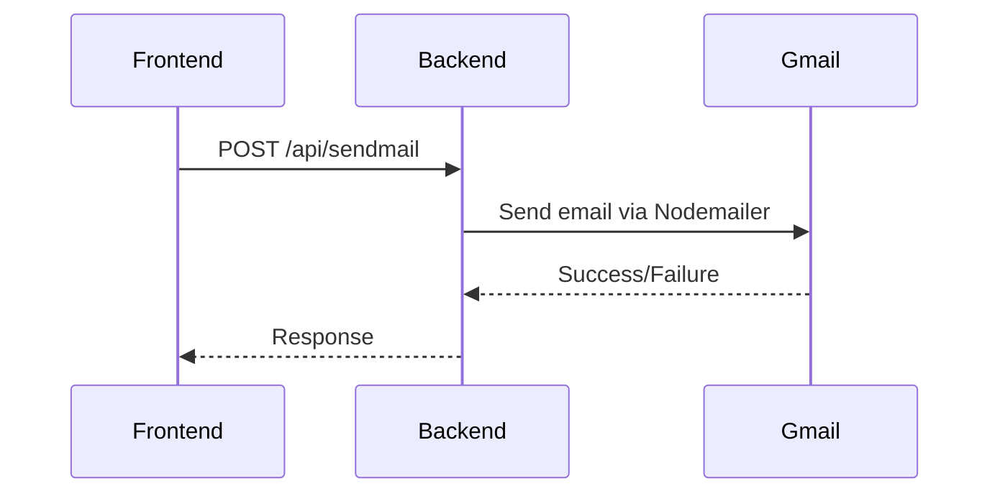

# 🌟 Developer Portfolio

[](https://code-red-l103.onrender.com/)

A modern, high-performance portfolio website with contact functionality built with cutting-edge technologies.

<!--   -->

## ✨ Features

- 🚀 Blazing fast performance with Vite + React
- 🌈 Beautiful UI with Chakra UI components
- ✉️ Functional contact form with Node.js backend
- 📱 Fully responsive design
- 🎯 SEO optimized

## 🛠 Tech Stack

### Frontend

| Technology                                                                                                      | Purpose                   |
| --------------------------------------------------------------------------------------------------------------- | ------------------------- |
|                 | Next-gen frontend tooling |
|              | Component-based UI        |
|  | Accessible design system  |

### Backend

| Technology                                                                                                 | Purpose            |
| ---------------------------------------------------------------------------------------------------------- | ------------------ |
|  | JavaScript runtime |
|    | Web framework      |
|                           | Email sending      |

## 🚀 Getting Started

### Prerequisites

- Node.js (v16+ recommended)
- npm/yarn/pnpm
- Gmail account (for contact form)

### Installation

1. **Clone the repository**

```bash
git clone https://github.com/your-username/portfolio.git
cd portfolio
```

2. **Set Up Frontend**

```bash
    cd frontend
    npm install
    npm run dev
```

3. **Setup Backend**

```bash
    cd ../backend
    npm install
```

4. Create **.env** file

```env
    GMAIL_USER=your-email@gmail.com
    GMAIL_PASS=your-app-password
    PORT=5000
```

5. **Start Server**

```bash
    npm start
```

### 📥 Contact Form Workflow

1. User Submits contact form
2. Frontend sends POST request to /api/sendmail
3. Backend processes request with nodemailer
4. Email is delivered to my inbox for awaited reply



### 📞 Contact

- Your Name - Ambali Oladele Ridwan
- Phone No - 09056862641
